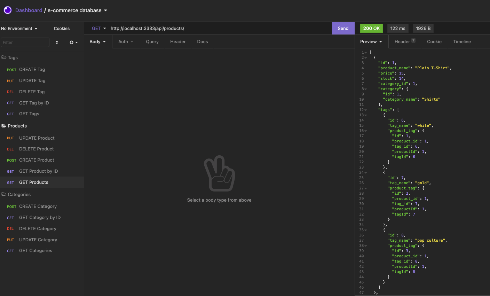

# E-Commerce Back End

> E-Commerce back end using Express.js, Sequelize &amp; MySQL.
> Demo [_here_](https://watch.screencastify.com/v/S253ikEAlZHQgpfVjjkS).

## Table of Contents

- [General Info](#general-information)
- [Technologies Used](#technologies-used)
- [Features](#features)
- [Screenshots](#screenshots)
- [Setup](#setup)
- [Usage](#usage)
- [Contact](#contact)
- [License](#license)

## General Information

- An e-commerce back end using an Express.js API with Sequelize to interact with a MySQL database.
- API GET, POST, PUT, and DELETE routes set up to manage a database that includes products, categories and tags.

## Technologies Used

- JavaScript
- Node.js
- Sequelize
- MySQL2
- Express.js
- Dotenv

## Features

- Create, View, Update and Delete Products
- Create, View, Update and Delete Categories
- Create, View, Update and Delete Tags

## Screenshots



## Setup

This project requires Node.js and MySQL to be installed.

Once project has been cloned, run the following in the command line to install the project dependencies - Sequelize, MySQL2, Express.js and Dotenv:

```
npm install
```

When dependencies have been installed, set up your environment variables in the .env.EXAMPLE file with your MySQL user and password. Remember to remove ".EXAMPLE" from the file name before continuing.

Next create your database by entering the following commands:

```
mysql -u root -p
```

Enter your MySQL password when prompted. Set up your database with the following command:

```
SOURCE db/schema.sql;
```

Check that your ecommerce_db database has been created by using the following command:

```
SHOW DATABASES;
```

Once the database has been created, exit the MySQL command line.

## Usage

Set up test seeds for the database by executing:

```
npm run seed

or

node seeds/index.js
```

Enter the following to run the application and start the server:

```
npm start

or

node server.js
```

And now your e-commerce back end is ready to go!

## Contact

Created by [@lilyso](https://github.com/lilyso) - feel free to contact me!

## License

This project is open source and available under the [MIT License](LICENSE).
